# Differential Growth Pattern Generator

A pure Python implementation of the differential growth algorithm for generating organic, coral-like patterns. Nodes along a closed curve attract neighbors, repel distant nodes, and split edges that stretch too long, producing naturally branching structures.

No external dependencies — uses only the Python standard library. PyPy compatible for 8-10x speedup.

## Examples

### 1. Organic Growth

A circle expanding into dense coral-like branching.

```bash
pypy3 diffgrowth.py --steps 1000 --growth 0.7 --repulsion 0.8 --noise 0.15 \
  --seed 42 --output examples/organic.svg
```

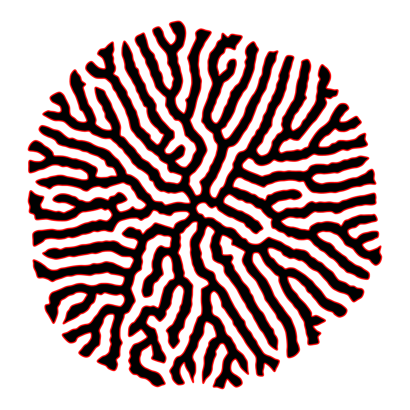

### 2. Bounded Circle

Growth constrained inside a circular boundary — the curve fills the available space.

```bash
pypy3 diffgrowth.py --steps 1000 --bounds 100 100 700 700 --bound-shape circle \
  --boundary-repulsion 0.8 --growth 0.6 --repulsion 0.7 --noise 0.12 \
  --seed 42 --output examples/bounded_circle.svg
```

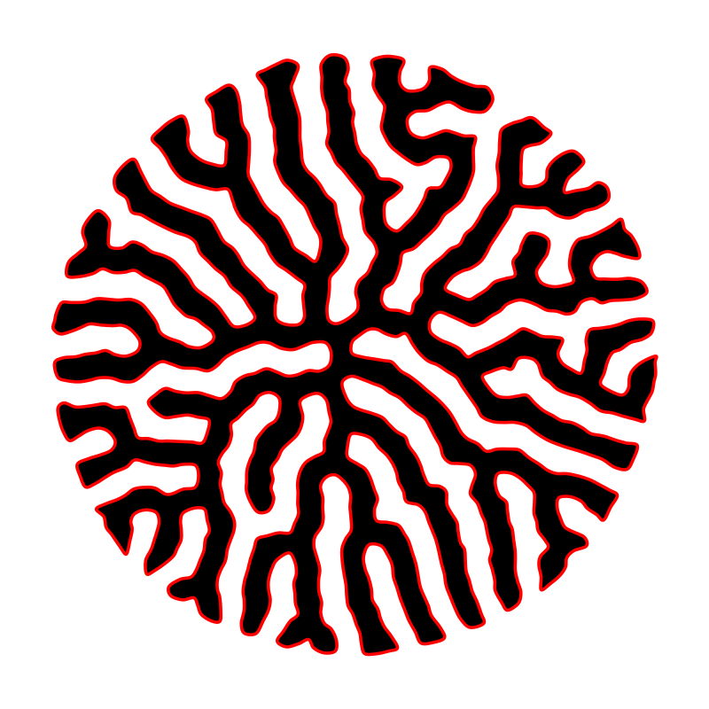

### 3. Star Burst

A star starting shape that blooms outward with high noise for an energetic look.

```bash
pypy3 diffgrowth.py --steps 800 --shape star --initial-nodes 30 \
  --growth 0.8 --repulsion 0.6 --noise 0.25 --alignment 0.3 \
  --seed 42 --output examples/star_burst.svg
```

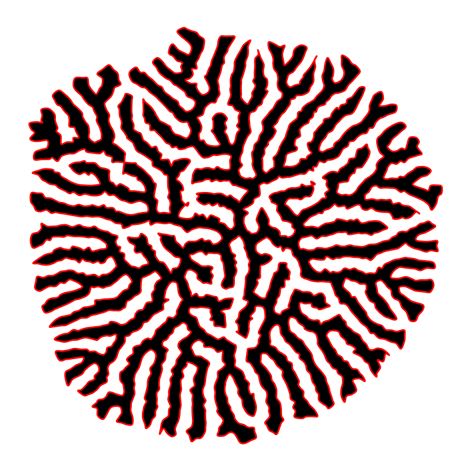

### 4. Fine Detail

Using `--detail-scale 0.5` to halve the pattern grain for intricate, tightly-packed lines.

```bash
pypy3 diffgrowth.py --steps 1200 --detail-scale 0.5 \
  --growth 0.6 --repulsion 0.7 --noise 0.1 \
  --seed 42 --output examples/fine_detail.svg
```

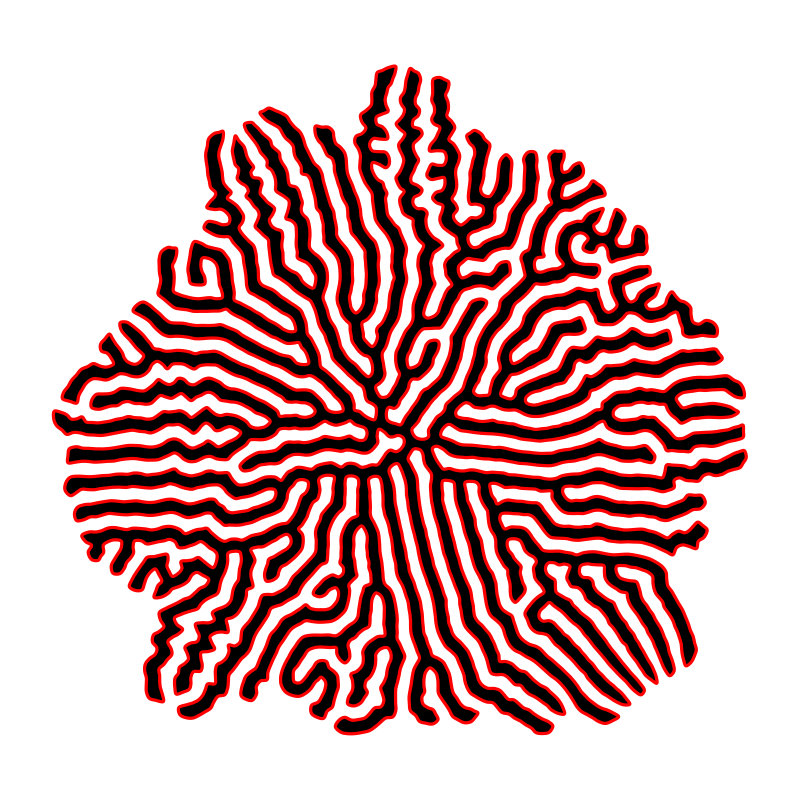

### 5. Heart Growth

Differential growth filling a heart SVG boundary, starting from between the lobes. Brown core aging to green tips.

```bash
pypy3 diffgrowth.py --svg-file heart.svg --svg-mode constrain --detail-scale 0.6 \
  --growth 0.6 --repulsion 0.7 --noise 0.1 --steps 2500 \
  --seed 42 --start-offset 0 -70 \
  --stroke-color brown --stroke-tip forestgreen --fill-color black \
  --output examples/heart_growth.svg
```

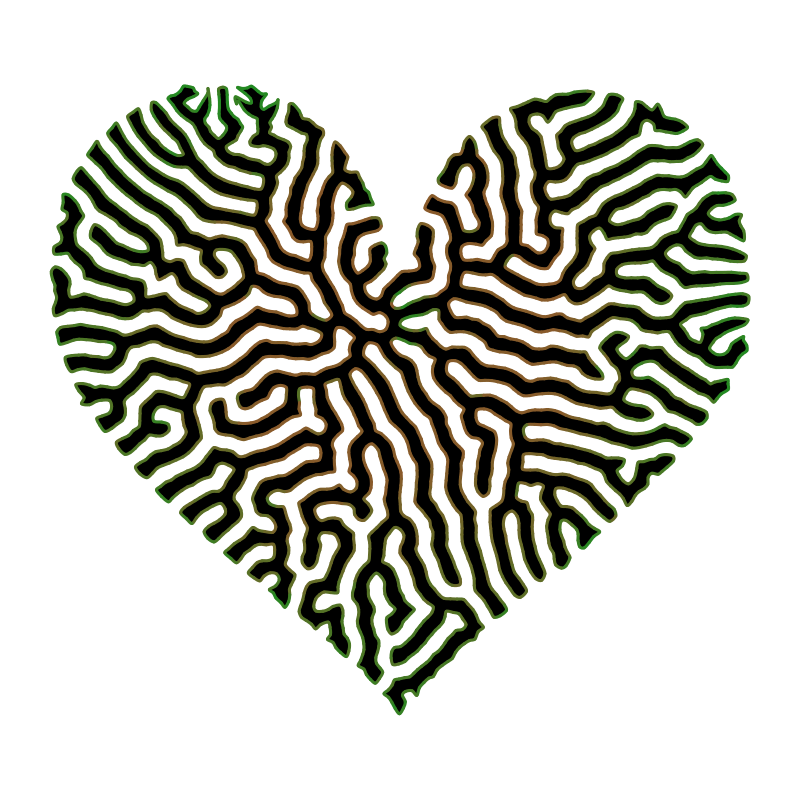

### 6. Thick Compact

Using `--detail-scale 2.0` for coarse, chunky branches with low growth to keep them close.

```bash
pypy3 diffgrowth.py --steps 800 --detail-scale 2.0 \
  --growth 0.4 --repulsion 0.6 --noise 0.1 --alignment 0.6 \
  --seed 42 --output examples/thick_compact.svg
```

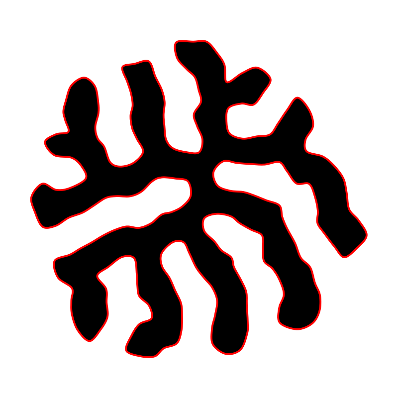

### 7. Dense 300

Starting with 300 nodes for a large, complex initial circle. Branches thicken toward the edges where there's no inward pressure from neighboring growth.

```bash
pypy3 diffgrowth.py --steps 500 --growth 0.6 --repulsion 0.7 --noise 0.1 \
  --seed 42 --initial-nodes 300 --output examples/dense_300.svg
```

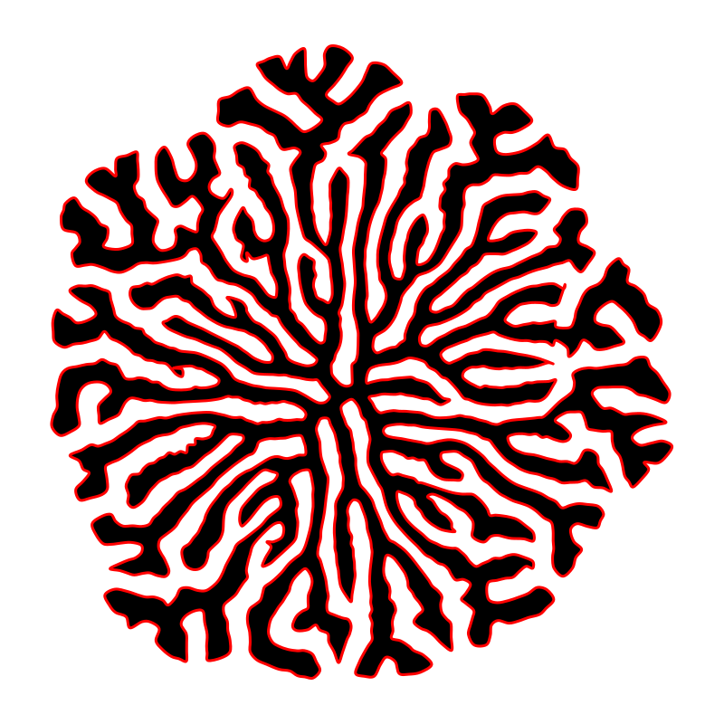

### 8. Calligraphic

Variable stroke width driven by direction — segments parallel to 45° get 7× thicker, like an angled pen nib.

```bash
pypy3 diffgrowth.py --steps 800 --growth 0.7 --repulsion 0.8 --noise 0.15 \
  --seed 77 --variable-stroke --stroke-straights 1 --stroke-curves 1 \
  --stroke-multiplier 7 --stroke-angle 45 \
  --stroke-color black --fill-color white --output examples/calligraphic.svg
```

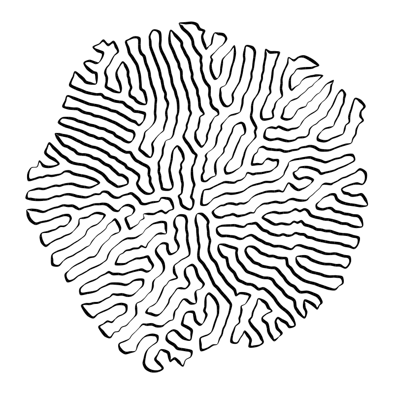

### 9. Curvature Stroke

Variable stroke width driven purely by curvature — thick at tight bends, thin along straight runs, with no directional bias.

```bash
pypy3 diffgrowth.py --steps 800 --growth 0.7 --repulsion 0.8 --noise 0.15 \
  --seed 77 --variable-stroke --stroke-curves 8 --stroke-straights 0.5 \
  --stroke-multiplier 1 \
  --stroke-color black --fill-color white --output examples/curvature_stroke.svg
```

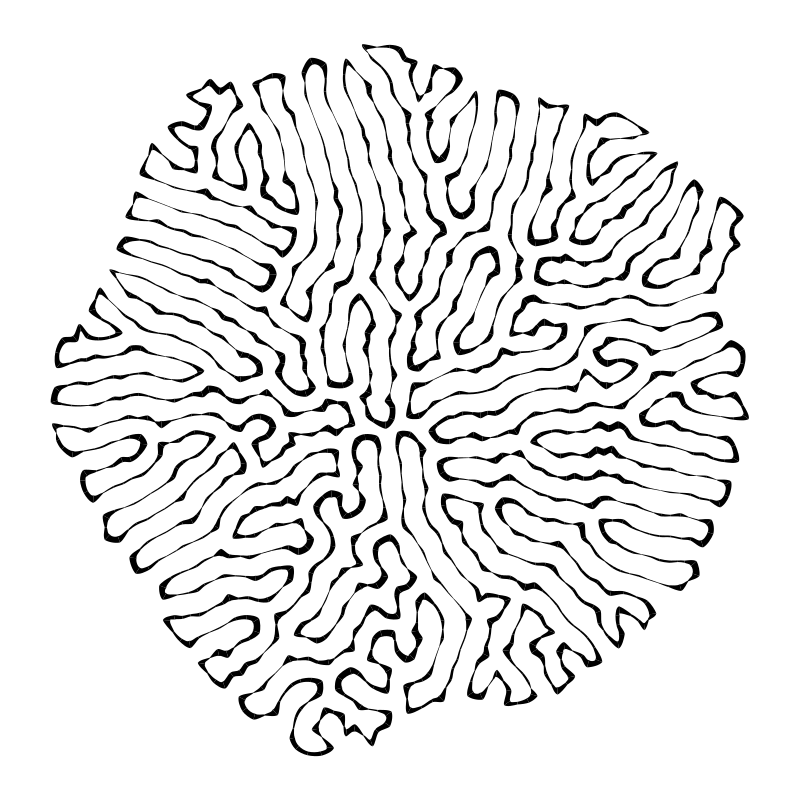

### 10. Twisted Growth

Tangential twist force spins the growth into a swirling spiral. Age gradient from brown (old core) to green (young tips).

```bash
pypy3 diffgrowth.py --steps 1000 --growth 0.7 --repulsion 0.8 --noise 0.15 \
  --seed 42 --twist-strength 2.5 \
  --stroke-color brown --stroke-tip forestgreen --fill-color black \
  --output examples/twist.svg
```

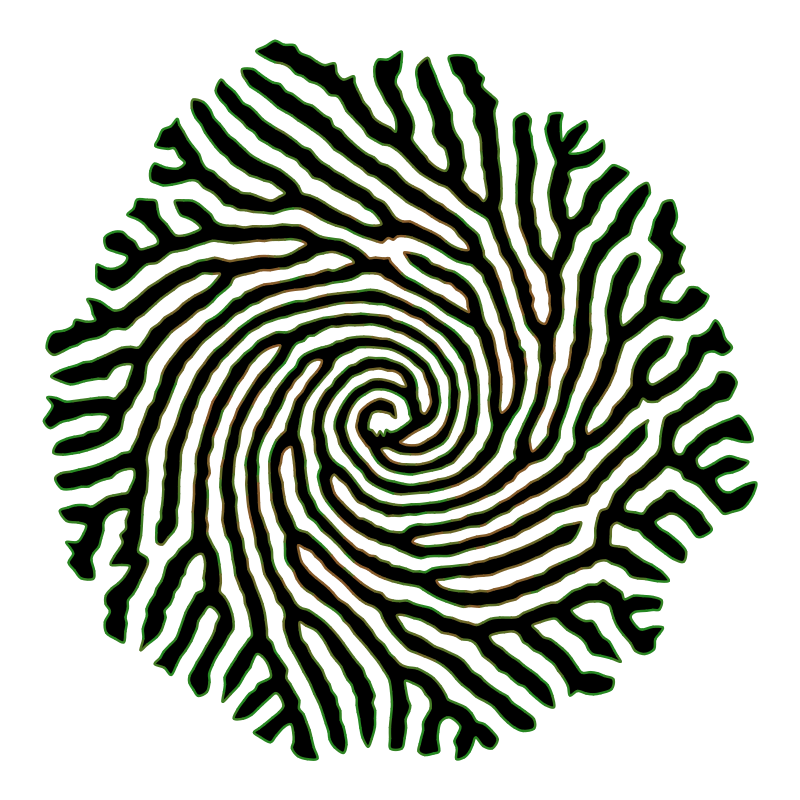

### 11. Butterfly Fill

Growth filling inward from a butterfly silhouette edge. Narrow antennae filtered out with `--svg-min-width`.

```bash
pypy3 diffgrowth.py --svg-file butterfly.svg --svg-mode fill --svg-samples 200 \
  --svg-min-width 40 --detail-scale 0.85 --growth 0.7 --repulsion 0.8 --noise 0.15 \
  --steps 1000 --seed 42 \
  --stroke-color brown --stroke-tip forestgreen --fill-color black \
  --output examples/butterfly_growth.svg
```

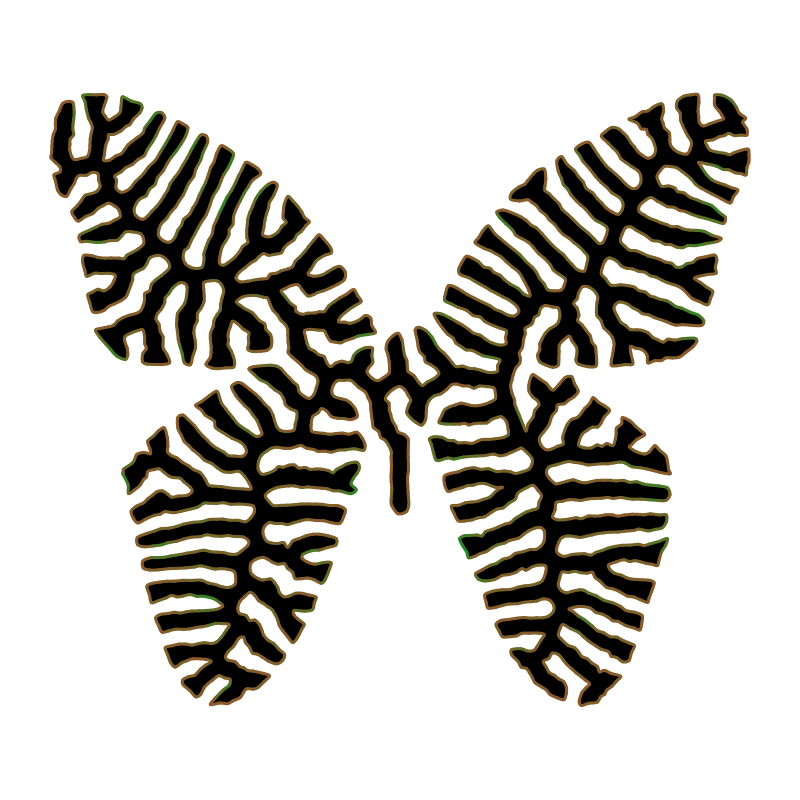

### 12. Differential Line

Open-ended differential line — growth expands upward only from a horizontal baseline. Unlike closed curves, the endpoints are free.

```bash
pypy3 diffgrowth.py --shape line --initial-nodes 80 --start-offset 0 250 \
  --steps 500 --growth 0.7 --repulsion 0.7 --noise 0.1 \
  --growth-direction 270 \
  --seed 42 --output examples/differential_line.svg
```

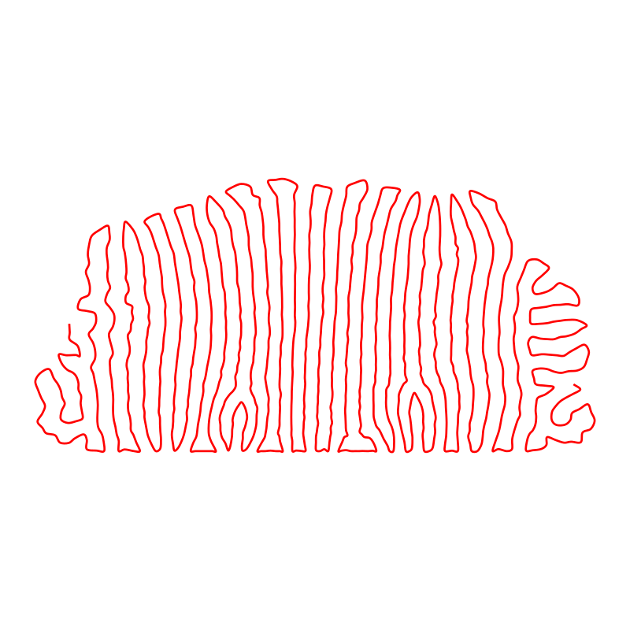

### 13. Open Line

An open line growing freely in both directions — same open-ended topology as the differential line, but without a directional constraint.

```bash
pypy3 diffgrowth.py --shape line --initial-nodes 100 \
  --steps 600 --growth 0.7 --repulsion 0.8 --noise 0.12 \
  --seed 42 --output examples/open_line.svg
```

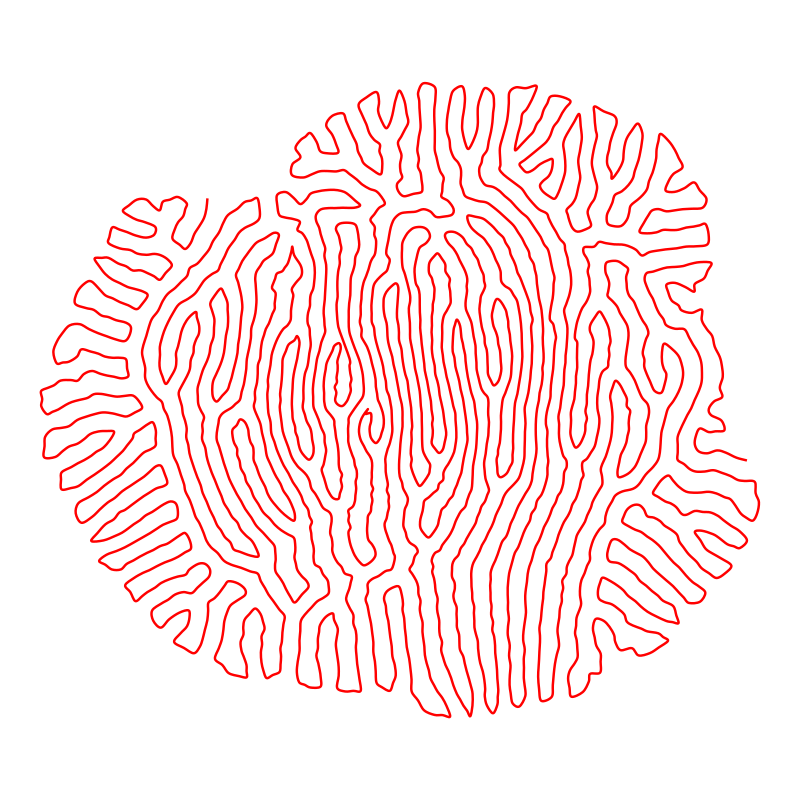

## Parameters

### Force Parameters (0-1 scale)

| Parameter | Default | Description |
|-----------|---------|-------------|
| `--growth` | 0.5 | Outward force along curve normals |
| `--repulsion` | 0.5 | Force pushing nodes/edges apart |
| `--attraction` | 0.5 | Force pulling neighbors together |
| `--alignment` | 0.5 | Smoothing force toward neighbor midpoint |
| `--noise` | 0.1 | Random perturbation per step |
| `--damping` | 0.5 | Velocity dampening (0=instant stop, 1=no friction) |
| `--detail-scale` | 1.0 | Global pattern grain (0.5=finer, 2.0=coarser) |

### Shape & Constraints

| Parameter | Default | Description |
|-----------|---------|-------------|
| `--shape` | circle | Starting shape: `circle`, `rectangle`, `triangle`, `star`, `line` (line = open curve) |
| `--bounds` | none | Bounding region: `MIN_X MIN_Y MAX_X MAX_Y` |
| `--bound-shape` | rectangle | Shape of bound: `rectangle`, `circle`, `star` |
| `--boundary-repulsion` | 0 | Force pushing away from bounds (0-1) |
| `--svg-file` | none | SVG file to import as shape or boundary |
| `--svg-mode` | grow | How to use SVG: `grow` (radiate outward) or `constrain` (fill inside) |
| `--svg-scale` | auto | Scale factor for imported SVG |
| `--svg-samples` | auto | Points to sample along SVG path |

### Other Options

| Parameter | Default | Description |
|-----------|---------|-------------|
| `--steps` | 200 | Number of simulation steps |
| `--initial-nodes` | 20 | Starting node count |
| `--seed` | random | Random seed for reproducibility |
| `--width` | 800 | Canvas width |
| `--height` | 800 | Canvas height |
| `--no-intersection-check` | off | Disable runtime intersection checking (faster) |
| `--no-post-process` | off | Skip post-process intersection cleanup |
| `--safe-mode` | off | Auto-adjust repulsion for safe fast mode |
| `--variable-stroke` | off | Enable variable stroke width rendering |
| `--stroke-curves` | 6.0 | Stroke width at tight curves |
| `--stroke-straights` | 0.5 | Stroke width at straight sections |
| `--stroke-angle` | 0 | Direction angle for directional thickness (0-360) |
| `--stroke-multiplier` | 1.0 | Thickness multiplier parallel to stroke-angle |
| `--stroke-color` | red | Stroke/line color |
| `--stroke-tip` | none | Tip color for age gradient (old=stroke-color, young=stroke-tip) |
| `--fill-color` | black | Fill color for curve interior |
| `--directional-strength` | 0 | Uniform directional pull force (like gravity/wind) |
| `--directional-angle` | 270 | Direction angle in degrees (270=down, 0=right) |
| `--twist-strength` | 0 | Tangential twist force around image center (creates spirals) |
| `--growth-direction` | none | Restrict growth to one direction (angle in degrees, 270=up) |
| `--output` | growth.svg | Output filename |
| `--examples` | off | Print 30 example command lines and exit |

## How It Works

Each simulation step:
1. **Attraction** pulls neighboring nodes together to maintain edge connectivity
2. **Repulsion** pushes non-adjacent nodes apart to prevent overlap
3. **Growth** applies outward normal force to expand the curve
4. **Alignment** smooths the curve toward neighbor midpoints
5. **Noise** adds randomness for organic variation
6. **Edge splitting** subdivides edges that exceed the maximum length

A spatial hash grid provides O(1) neighbor lookups, making the algorithm efficient even with thousands of nodes.

After simulation, a post-process step resolves any remaining self-intersections using 2-opt swaps — reversing the node order between two crossing edges so they reconnect without crossing. This is purely topological (no node positions change) and guarantees intersection-free output.

### Key Relationships

| Ratio | Effect |
|-------|--------|
| growth < repulsion | Expands freely, many branches |
| growth ~ repulsion | Balanced branching |
| growth > repulsion | Compact, limited growth |

For intersection-free results without checking: `repulsion > 0.2 * growth + 3 * noise`. Use `--safe-mode` to auto-adjust.

## Performance

PyPy gives ~10x speedup over CPython. Install with `brew install pypy3` (macOS) or `apt install pypy3` (Linux).

## License

MIT
